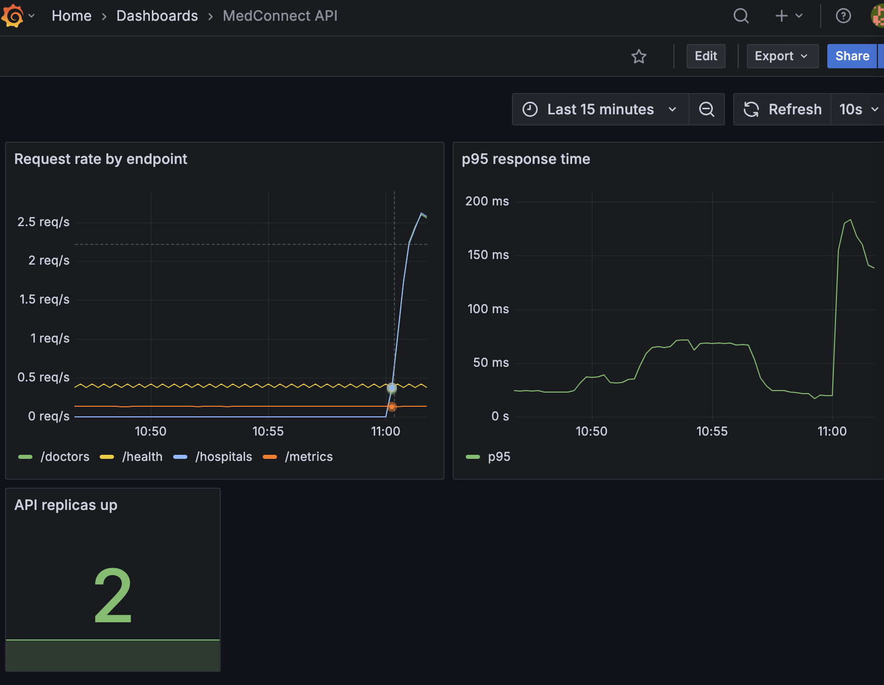

# MedConnect

Find doctors by specialty and compare lab test prices across Nigerian hospitals and labs, then book an appointment.

Built as a DevOps portfolio project: the application is deliberately small, the infrastructure around it is the focus.

## Architecture

    client --> FastAPI (api) :8000 --> PostgreSQL (db) :5432

Both services run as containers, orchestrated with Docker Compose locally and Kubernetes manifests for cluster deployment.

## Running it

    docker compose up -d --build
    curl http://localhost:8000/health

## Endpoints

| Method | Path | Purpose |
|---|---|---|
| GET | /health | liveness check |
| GET | /metrics | Prometheus metrics |
| GET | /hospitals | list hospitals |
| GET | /doctors | doctors by specialty, cheapest first |
| GET | /tests | lab tests by name, cheapest first |
| POST | /bookings | create a booking |
| GET | /bookings | list bookings |

## Design decisions

Database in a separate container, not alongside the app. Keeps the data layer independently scalable and restartable, and mirrors production deployment.

Health check dependency in Compose. The API waits for Postgres to report healthy rather than merely started, avoiding the common race where the app boots first and crashes on connect.

Dependency versions pinned. An unpinned build can pull a newer incompatible release months later and fail for no visible reason.

Config via environment variables. No credentials in the image or the repository.

Prices stored as integers. Avoids floating-point rounding on currency.

## Data

Hospital and lab names and locations are real. Doctor names, fees and availability are sample data - no real practitioner details are published here.

## Status

- [x] API and database
- [x] Containerised with Docker Compose
- [x] CI pipeline with image vulnerability scanning
- [x] Kubernetes manifests
- [x] Prometheus and Grafana
- [x] Terraform

## Monitoring

Prometheus discovers the API pods through the Kubernetes API and scrapes `/metrics` from each replica. Grafana starts with the Prometheus data source and the dashboard already provisioned from files in `monitoring/`, so nothing is configured by hand.

    kubectl apply -f monitoring/
    kubectl port-forward service/grafana 3000:3000

## Rebuild from scratch

The cluster is created by Terraform and everything on it is deployed from manifests in this repo:

    cd terraform && terraform init && terraform apply && cd ..
    docker build -t medconnect-api:latest ./api
    kind load docker-image medconnect-api:latest --name medconnect
    kubectl apply -f k8s/ -f monitoring/
    curl http://localhost:30080/hospitals

Terraform maps NodePort 30080 from the cluster to the host, so the API is reachable without a port-forward.

**Lesson learned:** pinning the node image to v1.37.0 made `kubeadm init` fail, because the Terraform kind provider bundles its own kind version that did not support that image. Leaving the image unset lets the provider choose a compatible one.
